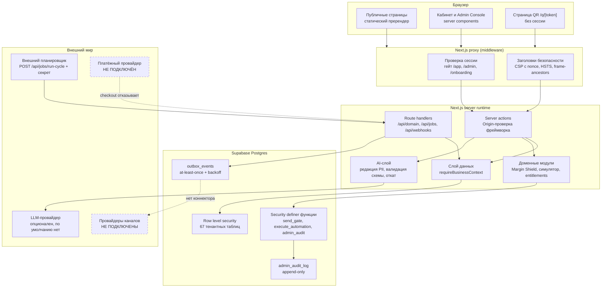
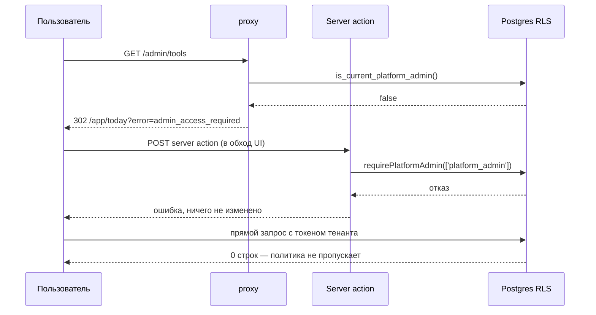

# QADAM Architecture

Актуально на 2026-07-30 после Prompt 2. Этот документ разделяет подтверждённую текущую реализацию и целевую систему.

## Реализованное детерминированное ядро

```text
src/domain (no React / no database imports)
  ├─ Business Twin normalizer + provenance/readiness
  ├─ comparable-window Signal Detector (timezone aware; no causal claim)
  ├─ RFM/lifecycle segmentation + consent-first audience
  ├─ fixed-point GOS / Scenario Simulator / Margin Shield
  ├─ versioned Growth Contract compiler
  ├─ recommendation/contract/automation state machines
  └─ Impact Ledger + shared Explain Every Number object
          │ untrusted command + server recalculation
          ▼
GrowthContractService + runtime validators
  ├─ POST /api/domain/growth-contracts/compile
  ├─ POST /api/domain/growth-contracts/:id/transition
  └─ POST /api/domain/growth-contracts/:id/launch
          │ authenticated Supabase session / RLS
          ▼
Postgres command boundary
  ├─ optimistic_version + idempotency receipts
  ├─ state/consent/margin/limits triggers
  ├─ atomic transition + outbox + activity
  ├─ idempotent launch/delivery/reward keys
  └─ consent recheck at audience inclusion and delivery
```

Клиентский preview не является authority. Compile service заново читает tenant data через RLS, пересчитывает consent count, contribution margin, scenarios, Margin Shield и GOS, затем сравнивает optional preview hash. Approve/launch повторно блокируются Postgres triggers/RPC.

## Реализованная data/auth foundation

```text
Next.js 16 App Router
  ├─ @supabase/ssr cookie clients (browser/server)
  ├─ proxy.ts → getClaims() → /app auth gate → DB admin RPC gate
  ├─ Auth actions: sign-up/sign-in/sign-out/reset/callback
  └─ server-only admin client (SUPABASE_SECRET_KEY only)
          │
          ▼
Supabase Data API (explicit grants + RLS)
  ├─ public: 64 normalized application tables
  ├─ private: membership/admin helpers and platform assignments
  ├─ auth.users → profiles trigger
  └─ storage.objects → private business-assets/business-exports
          │
          ▼
Postgres migrations (single source of truth)
  ├─ foundation: tenancy/profile/plan/entitlement
  ├─ domain: operations/CRM/loyalty/Growth/automation/platform
  ├─ security: grants/RLS/storage
  ├─ safeguards: FK indexes/cursors/immutability/append-only/mock guard
  ├─ private deterministic ID support for reproducible fixtures
  └─ consolidated non-overlapping RLS policies
```

The browser uses only `NEXT_PUBLIC_SUPABASE_PUBLISHABLE_KEY`. Secret access is isolated in `src/lib/supabase/admin.ts` with `server-only`; a static bundle/source check rejects public secret names and Client Component imports.

## Baseline до Prompt 1

```text
Browser
  └─ Next.js 16 App Router / React 19
      ├─ public routes: landing, features, solutions, demo, auth mockups
      ├─ /app routes: Today, customers, campaigns, content, analytics, tools
      ├─ /admin routes: read-only demo views
      ├─ local UI state: language + ephemeral component state
      └─ src/mock-data (static TypeScript arrays)
           └─ src/services/qadamService.ts (async delay wrappers)
                └─ partial QadamDataAdapter interface (3 read methods only)
```

Исторически было подтверждено инспекцией:

- frontend-only Next.js application; 49 production routes;
- до Prompt 1 не было API routes, server actions, proxy, database client, Auth или RLS;
- UI в основном читает mock-data напрямую, обходя service/adapter boundary;
- сохранение между перезагрузками есть только для языка (`qadam_lang` в localStorage);
- campaign wizard хранит только текущий шаг; admin — read-only; формы подавляют submit без persistence;
- `qadam_demo_seed.json`, env examples, deployment config и automated tests отсутствуют.

## Целевая схема

```text
Web UI (public/app/admin)
  │ typed commands/queries; no secrets
  ▼
Application layer
  ├─ Growth Contract orchestrator
  ├─ Campaign/Content/Automation services
  ├─ Customer Memory + segmentation
  ├─ Impact Ledger + attribution
  └─ Admin catalog/template lifecycle
  │
  ├───────────────┬─────────────────┬──────────────────┐
  ▼               ▼                 ▼                  ▼
Policy engine   Deterministic     Repository ports   Integration ports
consent/RBAC/   finance engine    tenant-scoped      messaging/POS/
approval/flags  Margin Shield     Postgres + RLS     AI/storage/maps
  │               │                 │                  │
  └──────────── audit/event ledger + observability ────┘
```

## Модульные границы

| Модуль | Ответственность | Не должен делать |
|---|---|---|
| Business Twin | профиль точки, capacity, каталог, costs, goals, provenance | вычислять outcome кампаний |
| Signal Engine | агрегаты, comparator, detection, confidence | утверждать причинность |
| Growth Contract Compiler | собрать версионируемый contract из утверждённых входов | обходить consent/Margin Shield |
| Finance Engine | low/base/high, contribution, cost, ROI, cannibalization | использовать LLM для арифметики |
| Consent & Audience | inclusion/exclusion, channel consent, suppression | отправлять сообщения |
| Campaign Studio | draft/edit/approve/launch/pause workflow | напрямую вызывать vendor из UI |
| Content Studio | RU/KK variants, alt text, CTA, tracking assets | публиковать без approval/feature flag |
| Automation Center | rules, scheduling, quiet hours, stop-loss | выполнять rule без idempotency/audit |
| Impact Ledger | forecast/influenced/estimate/mock/fact с provenance | переименовывать estimate в fact |
| Tool Catalog/Admin | lifecycle, versioning, taxonomy, entitlements | смешивать tenant admin и platform admin |

## Поток Growth Contract

1. Ingest создаёт tenant-scoped observations и provenance.
2. Signal Engine детерминированно фиксирует период и comparator.
3. Explanation service создаёт гипотезы; confidence хранится отдельно от signal certainty.
4. Audience engine применяет inclusion, exclusion, consent и suppression.
5. Finance Engine рассчитывает три сценария и Margin Shield.
6. Compiler создаёт immutable contract version и bilingual content references.
7. Approval policy разрешает только допустимое действие для роли/тарифа.
8. Connector job идемпотентно выполняет запуск или честно остаётся `not_connected`.
9. Events попадают в Impact Ledger с `kind`, source и period.
10. Learn создаёт новую рекомендацию, не переписывая прошлую версию contract.

## Real/mock boundary

Режим выбирается server-side через `QADAM_APP_MODE`. Local seed создаёт только synthetic demo tenants и аварийно отказывается работать вне стандартного локального Supabase JWT secret. `db push --include-seed` и `db reset --linked` запрещены для production. `PRODUCTION_MODE` не принимает `is_mock=true` через database trigger.

## Безопасность

- Tenant ID выводится из доверенной server session, никогда из произвольного browser payload.
- RLS покрывает все tenant-owned таблицы; platform admin — отдельная роль и policy path.
- PII не попадает в analytics/log payload без минимизации/маскирования.
- Secret/service keys доступны только server/worker runtime.
- Approval, consent, connector call и outcome event имеют append-only audit entries.
- Финансовые формулы версионируются и покрываются golden tests.

## Migration seam

Database/Auth и deterministic domain foundation существуют, но product views всё ещё читают старые TypeScript fixtures. Следующий этап переводит их по use-case на typed APIs/repositories; прямые mock imports удаляются постепенно без переписывания визуальных компонентов.

## Актуальные Supabase решения

- SSR следует current `@supabase/ssr` contract: request-scoped server client, `cookies.getAll/setAll`, cache headers из proxy и `getClaims()` вместо доверия server-side `getSession()`.
- Data API exposure opt-in: default privileges revoked, grants явные и сопровождаются RLS.
- Authorization derives from `business_members`; `user_metadata` не участвует. Platform JWT hint не достаточен — `/admin` вызывает DB-backed `is_current_platform_admin()`.
- Security-definer helpers находятся в non-exposed `private`, имеют empty search path и no PUBLIC execute.
- Storage paths начинаются с opaque business UUID; bucket private, MIME/size ограничены, upsert имеет SELECT/INSERT/UPDATE policies.
- Clean local replay, 36 pgTAP assertions, schema lint и advisors подтверждены; remote link/deploy не выполнялись.

## AI layer (Prompt 4, 2026-08-01)

### Position in the system

The AI layer sits beside the deterministic domain, never inside it.

```
owner goal ─┐
            ├─> AI layer ──> mechanic shape + RU/KK copy ──┐
business ───┘   (untrusted)                                │
                                                           v
business twin + limits ──> Simulator ──> Margin Shield ──> Growth Contract ──> launch
                           (authoritative, deterministic, src/domain)
```

A model can propose a mechanic and write copy. It cannot compute a number, change a
goal, widen an audience, raise a budget, alter consent, or authorise a launch. Every
figure the owner sees is produced by `simulateScenarios` / `evaluateMarginShield` from
RLS-protected tenant data, whether the mechanic came from a model, a template, or the
owner's own typing.

### Modules

| Module | Responsibility |
|---|---|
| `src/ai/contract.ts` | Provider-neutral types, `AiProvider` interface, strict runtime validation of the campaign schema, balanced-brace JSON extraction |
| `src/ai/redaction.ts` | PII redaction, prompt-injection neutralisation, content safety for generated copy |
| `src/ai/prompt.ts` | Prompt assembly; owner text enters only inside a delimited `<business_data>` block after sanitising |
| `src/ai/providers.ts` | Anthropic and OpenAI adapters; server-side config resolution; the only place a provider key is read |
| `src/ai/deterministic.ts` | Guaranteed template generator producing the identical schema |
| `src/ai/generator.ts` | Orchestration: cost guard → timeout → bounded retry with backoff → validate → safety → fallback |
| `src/ai/content-pack.ts` | One brief → post, short post, 3 stories, 15s script, messenger message, RU + KK, alt text |
| `src/server/ai/campaign-ai-service.ts` | Bridges AI output to the tenant database and recomputes all economics |

### Failure policy

Transport failures (`timeout`, `429`, `5xx`) are retried up to `QADAM_AI_MAX_ATTEMPTS`
with exponential backoff (250 ms, 500 ms, …). Failures that would repeat — `4xx`,
malformed JSON, schema mismatch — are not retried. Any failure, including no provider
being configured at all, falls through to the deterministic generator. The owner always
gets a usable result, and the UI states which path produced it.

### Provenance

`ai_generation_runs` records provider, model, source, prompt and schema version, a
SHA-256 digest of the **redacted** payload, latency, attempt count, token usage, cost,
status, failure kind and fallback reason for every attempt. A database CHECK constrains
`input_hash` to a 64-character hex digest so a prompt log can never be reversed into
owner text. `ai_usage_quota` enforces a per-business daily generation and cost budget;
a fallback consumes neither, so a provider outage cannot also exhaust the quota.

### Trust boundary summary

| Input | Trusted? | Control |
|---|---|---|
| Owner free text (brand voice, brief, previous campaign) | No | Redacted, injection-neutralised, wrapped as data |
| Model JSON | No | Strict schema validation, goal/mechanic/locale checks, content safety |
| Model numbers | Never used | Simulator recomputes from tenant data |
| Margin Shield verdict | Authoritative | Blocked mechanics compile no contract and cannot launch |
| Launch | Owner-gated | Explicit approval, server re-check, idempotency key, connector honesty |

## Execution and measurement layer (Prompt 5, 2026-08-01)

### The loop after approval

```
approved Growth Contract
        │
        ▼
  enqueue_delivery ──► campaign_deliveries (queued) ──► outbox_events (pending)
        │                                                      │
        │  send_gate re-checked at dispatch                    │ claim (lease)
        ▼                                                      ▼
  consent · suppression · quiet hours · caps          connector adapter (HTTP)
        │                                                      │
        └── refused ──► delivery.suppressed                    │ settle
                                                               ▼
                                       published │ backoff retry │ dead_letter
                                                               │
provider webhook (signed) ──► provider_events (raw, unique) ───┘
                                     │
                                     ▼ derived, keyed
                              campaign_events ──► impact pipeline
                                                        │
                          impact_baselines (immutable) ─┤
                                                        ▼
                                   influenced │ incremental │ mock │ verified
```

### Why the outbox

A campaign decision and its side effect cannot be in the same transaction: the decision
must be durable even if the provider is down, and the provider call must not hold a
database transaction open. The outbox splits them. Delivery becomes at-least-once, which
is why every consumer is keyed:

| Concern | Key |
|---|---|
| Delivery | `campaign_deliveries(business_id, idempotency_key)` |
| Outbox event | `outbox_events(business_id, idempotency_key)` |
| Automation run | `automation_runs(business_id, idempotency_key)` |
| Provider event | `provider_events(business_id, provider, external_event_id)` |
| Derived event | `campaign_events(business_id, source, external_event_ref)` |
| Reward ledger | `loyalty_ledger(idempotency_key)` |

### Gating, and where it happens

`send_gate` is a single database function called immediately before each dispatch, not
when the audience was built. It refuses on emergency stop, inactive business, suppression
entry, missing or revoked consent, quiet hours in the business timezone, the daily send
cap and a rolling 24-hour frequency cap. The worker calls it again even for a row the
audience builder already approved, because minutes may have passed.

### Automation modes and trust gates

Ten versioned rule templates live in `src/automations/catalog.ts`. Creating an automation
copies the template into the row and records `approved_template_version`, so editing a
template later cannot silently change what an owner agreed to.

`manual` and `assistant` produce a proposal and a notification and dispatch nothing.
`autopilot` is the only mode allowed to act, and a table CHECK requires an approved
template version and a named owner before that mode can even be stored. Today only
`stop_loss` ships with autopilot available, because it can pause a campaign but has no
power to restart or send.

### Connector adapters

One interface — `prepare`, `send`, `status`, `cancel`, `healthCheck`. Adapters move bytes
and report outcomes; they never decide whether a send is permitted.

- `mock` — DEMO_MODE, deterministic receipts, `simulated: true`, never externally capable.
- `webhook` — the only externally-capable adapter in this build; signed HMAC-SHA256 calls
  to an owner-controlled endpoint.
- `whatsapp` / `telegram` / `instagram` — declared boundaries that refuse explicitly and
  name the credentials they would need. They do not pretend.

### Impact: keeping four numbers apart

`influenced` is revenue from customers who received the campaign — genuine, but not
attributable. `incremental_estimate` is influenced minus an immutable recorded baseline,
and it is only emitted when the delivered sample clears `min_sample_size`; below that the
ledger records an observed difference with an interval and says so. `mock_actual` is demo
data. `verified_fact` requires a connected source and is never synthesised.

Baselines are fixed before launch and protected by a trigger that refuses both update and
delete: a new measurement version is the only way to change the comparison.

### Public storefront without PostGIS

PostGIS is not installed. Proximity uses the privacy-rounded `latitude_rounded` /
`longitude_rounded` on the offer with a haversine filter, and district remains the primary
filter with an explicit no-location fallback. No customer coordinate is stored, requested
or published. Views, clicks and saves are recorded in `nearby_offer_events` as intent and
are never counted as visits; a visit requires a verified QR scan or redemption.

## Platform layer (Prompt 6, 2026-08-01)

### Admin access has three independent gates

```
request  →  src/app/admin/layout.tsx   requirePlatformAdmin() on every render
         →  server action              requirePlatformAdmin(role subset) again
         →  RLS / security definer     is_platform_admin() in the database
```

Hiding the navigation link is decoration. A direct URL, a bookmark or a scripted POST all pass
through the layout gate; a server action re-checks with the narrower role set it needs; and every
table and function re-checks in the database. The role is read from a private assignment table —
`user_metadata` is never consulted, which the test suite asserts by inspecting the function body.

Sensitive operations (archive, rollback) additionally require a credential confirmation newer than
15 minutes, recorded next to the audit entry.

### Every admin mutation is audited by construction

Server actions do not write `admin_audit_log` directly. They call `admin_audit(...)`, which refuses
without a platform role and without a reason, and refuses a sensitive action without fresh re-auth.
The table is append-only: a trigger rejects UPDATE and DELETE, so an action cannot be taken and then
erased. Where an audit write fails after the mutation, the action rolls the mutation back rather than
leaving an unaudited change (see `setToolStatus`).

### Template versioning and history

A published version is frozen. Correcting a template means publishing a new version, and rollback
repoints the template without unpublishing anything, so "what was live on that date" stays answerable.
This is separate from — and weaker than — the Growth Contract guarantee: a contract carries its own
immutable `accepted_snapshot`, so it is unaffected by any template change, rollback included.

### Entitlements are data

Nothing branches on a plan code. A plan grants values for named keys; the server resolves the value
and either consumes a unit or refuses with the limit, the usage and the plan named. The refusal path
deliberately leaves the caller's draft untouched — an owner who hits a limit mid-wizard keeps their
work and sees what to do about it.

### Localisation architecture

`src/i18n/registry.ts` holds the message catalogue, glossary and formatters. Two rules make a third
language a data change:

- messages take **named parameters**, never concatenated fragments, because word order differs;
- plural forms come from `Intl.PluralRules`, not `n === 1` — Russian needs three forms and a hand-rolled
  check silently produces wrong Russian.

Domain logic never imports this module: formulas work in minor units with currency metadata, and only
the presentation layer formats. Per-business timezone and ISO currency drive `Intl.DateTimeFormat`
and `Intl.NumberFormat`.

### Privacy by construction

`data_inventory` and `retention_policies` are tables, and the privacy page renders them. The document
therefore describes what the schema actually holds rather than what someone intended. Erasure is
implemented as anonymisation where the law requires the record to survive: amounts stay, the person
does not.

Platform analytics is aggregate-only and suppresses a segment below five businesses, so an admin can
see how the platform is doing without ever seeing whose customers those are.

### Performance method

The committed seed is 180 customers, on which every plan is correctly a sequential scan.
`scripts/benchmark-explain.sql` builds a throwaway 50k-customer / 400k-transaction tenant inside a
transaction, runs EXPLAIN ANALYZE on the exact queries the hot screens issue, and rolls back. That is
the only way the index work could be checked honestly, and it immediately found a real defect
(see PROJECT_STATE).

Partitioning is deliberately **not** introduced. The threshold and migration path are recorded in the
RUNBOOK so the decision is a judgement rather than an omission.

## Диаграмма системы (Prompt 7, 2026-08-01)



Пунктиром обозначено то, чего нет: коннекторы каналов и платёжный провайдер. Их отсутствие
не обходится — соответствующие пути отказывают явно.

### Три независимых рубежа доступа



Скрытая ссылка в навигации — не защита. Каждый из трёх рубежей проверяется отдельным тестом:
`tests/e2e/admin.spec.mjs` (первый), `tests/security/http-suite.mjs` (второй),
`tests/security/rls-matrix.mjs` (третий, по всем 67 тенантным таблицам).

### Заголовки безопасности и CSP

`src/lib/security/headers.ts` формирует набор заголовков, `src/lib/supabase/proxy.ts`
проставляет их на каждый ответ. Политика различается по типу маршрута, и это осознанный
компромисс, а не недосмотр:

| Маршруты | `script-src` | Почему так |
|---|---|---|
| `/app`, `/admin`, `/login`, `/signup`, `/q/`, `/api`, `/customers`, `/onboarding` | `'self'` + nonce на запрос | Здесь есть данные тенанта и клиента. Внедрённый инлайн-скрипт без nonce не выполнится |
| Маркетинговые страницы | `'self' 'unsafe-inline'` | Они статически пререндерятся: HTML пишется на сборке и не может нести nonce на запрос. Пользовательский ввод там не рендерится вовсе |

`'strict-dynamic'` намеренно не используется: он обнуляет `'self'`, и тогда статические
страницы не смогли бы загрузить ни одного своего чанка. `style-src` сохраняет
`'unsafe-inline'` — инлайн-стиль не исполняется, но это записано как известный пробел,
а не замолчано.

### Обработка ошибок

Ошибка, брошенная в layout сегмента, ловится **родительской** границей, а не собственной.
Из-за этого падение `src/app/app/layout.tsx` обходило `src/app/app/error.tsx` и превращалось
в голый 500. Теперь:

- `requireBusinessContext` различает «база не ответила» (`DataUnavailableError`) и «членства
  нет» — раньше временный сбой PostgREST сообщал владельцу, что у него нет доступа;
- layout кабинета переводит отсутствие сессии или членства в редирект, а не в исключение;
- `src/app/error.tsx` и `src/app/global-error.tsx` дают понятный экран с кнопкой повтора
  и кодом для поддержки.
