# ERD — QADAM Growth OS

Сгенерировано из живой схемы: `node scripts/generate-erd.mjs`. Диаграмма не может разойтись
со схемой, потому что она из неё и строится. Всего таблиц: **80**, внешних
ключей: **139**.

Каждая таблица с колонкой `business_id` — тенантная: на ней включён row level security, и
изоляция проверяется автоматически (`node tests/security/rls-matrix.mjs`).

## Тенант и доступ

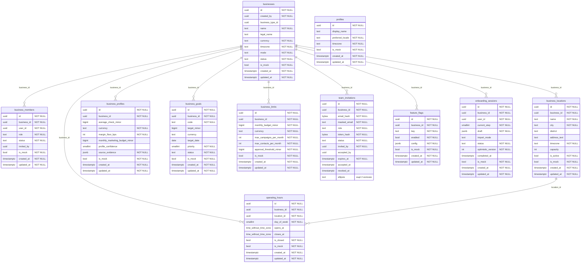

## Клиенты и согласия

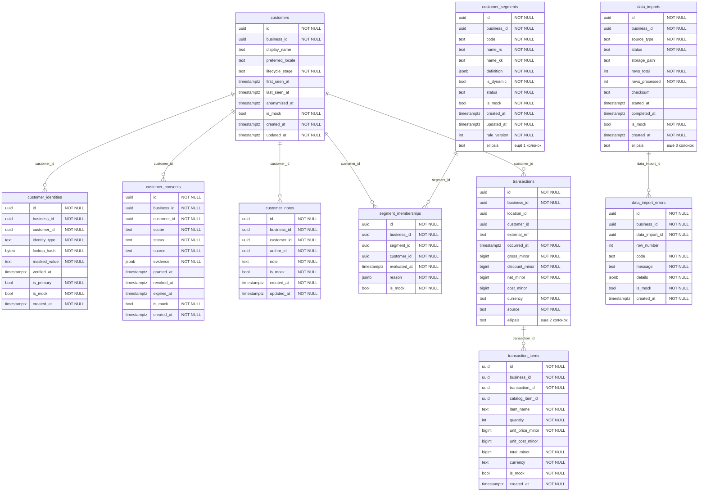

## Лояльность и QR

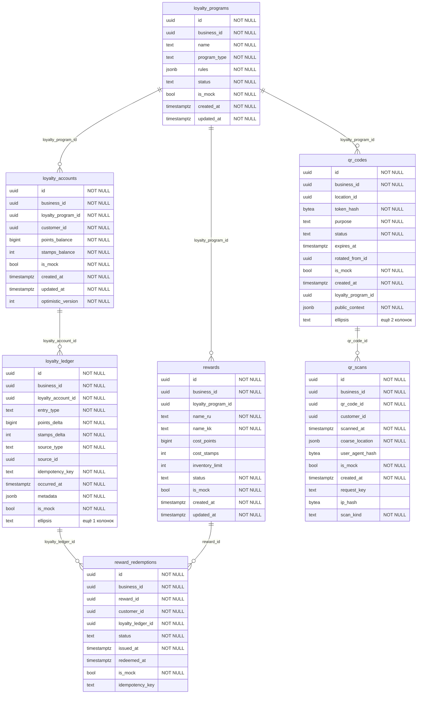

## Сигналы и решения

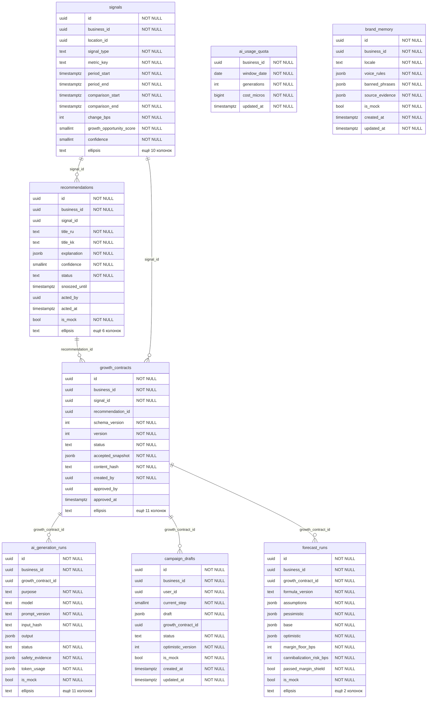

## Кампании и исполнение

```mermaid
erDiagram
  campaigns {
    uuid id "NOT NULL"
    uuid business_id "NOT NULL"
    uuid growth_contract_id "NOT NULL"
    text name "NOT NULL"
    text status "NOT NULL"
    text channel "NOT NULL"
    bigint budget_minor "NOT NULL"
    text currency "NOT NULL"
    timestamptz starts_at
    timestamptz ends_at
    jsonb stop_rule "NOT NULL"
    uuid created_by "NOT NULL"
    text ellipsis "ещё 6 колонок"
  }
  campaign_audiences {
    uuid id "NOT NULL"
    uuid business_id "NOT NULL"
    uuid campaign_id "NOT NULL"
    uuid customer_id
    uuid segment_id
    text inclusion_status "NOT NULL"
    text exclusion_reason
    text consent_scope
    text consent_status
    timestamptz evaluated_at "NOT NULL"
    jsonb rules_evidence "NOT NULL"
    bool is_mock "NOT NULL"
  }
  campaign_deliveries {
    uuid id "NOT NULL"
    uuid business_id "NOT NULL"
    uuid campaign_id "NOT NULL"
    uuid customer_id "NOT NULL"
    uuid content_item_id
    text provider_message_ref
    text idempotency_key "NOT NULL"
    text status "NOT NULL"
    timestamptz queued_at "NOT NULL"
    timestamptz sent_at
    timestamptz delivered_at
    text failure_code
    text ellipsis "ещё 2 колонок"
  }
  campaign_events {
    uuid id "NOT NULL"
    uuid business_id "NOT NULL"
    uuid campaign_id "NOT NULL"
    uuid delivery_id
    uuid customer_id
    text event_type "NOT NULL"
    timestamptz occurred_at "NOT NULL"
    text source "NOT NULL"
    text external_event_ref
    jsonb metadata "NOT NULL"
    bool is_mock "NOT NULL"
    timestamptz created_at "NOT NULL"
  }
  content_items {
    uuid id "NOT NULL"
    uuid business_id "NOT NULL"
    uuid campaign_id
    text content_kind "NOT NULL"
    text channel "NOT NULL"
    text locale "NOT NULL"
    text body "NOT NULL"
    text alt_text
    text cta
    text status "NOT NULL"
    int version "NOT NULL"
    bool is_mock "NOT NULL"
    text ellipsis "ещё 2 колонок"
  }
  promotions {
    uuid id "NOT NULL"
    uuid business_id "NOT NULL"
    uuid campaign_id "NOT NULL"
    text mechanism "NOT NULL"
    jsonb rules "NOT NULL"
    bigint min_order_minor
    bigint estimated_unit_cost_minor
    text currency "NOT NULL"
    bool is_mock "NOT NULL"
    timestamptz created_at "NOT NULL"
    timestamptz updated_at "NOT NULL"
  }
  redemptions {
    uuid id "NOT NULL"
    uuid business_id "NOT NULL"
    uuid campaign_id "NOT NULL"
    uuid promotion_id
    uuid customer_id
    uuid transaction_id
    uuid tracking_code_id
    timestamptz redeemed_at "NOT NULL"
    bigint order_total_minor "NOT NULL"
    bigint campaign_cost_minor "NOT NULL"
    text currency "NOT NULL"
    bool is_mock "NOT NULL"
    text ellipsis "ещё 1 колонок"
  }
  tracking_codes {
    uuid id "NOT NULL"
    uuid business_id "NOT NULL"
    uuid campaign_id "NOT NULL"
    uuid content_item_id
    bytea code_hash "NOT NULL"
    text public_code "NOT NULL"
    text purpose "NOT NULL"
    timestamptz expires_at
    bool is_mock "NOT NULL"
    timestamptz created_at "NOT NULL"
  }
  outbox_events {
    uuid id "NOT NULL"
    uuid business_id "NOT NULL"
    text aggregate_type "NOT NULL"
    uuid aggregate_id "NOT NULL"
    text event_type "NOT NULL"
    jsonb payload "NOT NULL"
    text status "NOT NULL"
    int attempts "NOT NULL"
    timestamptz available_at "NOT NULL"
    timestamptz processed_at
    text idempotency_key "NOT NULL"
    bool is_mock "NOT NULL"
    text ellipsis "ещё 6 колонок"
  }
  provider_events {
    uuid id "NOT NULL"
    uuid business_id "NOT NULL"
    text provider "NOT NULL"
    text channel "NOT NULL"
    text external_event_id "NOT NULL"
    text event_type "NOT NULL"
    uuid delivery_id
    uuid campaign_id
    bool signature_verified "NOT NULL"
    timestamptz received_at "NOT NULL"
    jsonb payload "NOT NULL"
    timestamptz processed_at
    text ellipsis "ещё 1 колонок"
  }
  business_channels {
    uuid id "NOT NULL"
    uuid business_id "NOT NULL"
    text channel_type "NOT NULL"
    text status "NOT NULL"
    text external_account_ref
    jsonb settings "NOT NULL"
    bool is_mock "NOT NULL"
    timestamptz created_at "NOT NULL"
    timestamptz updated_at "NOT NULL"
    text connector_state "NOT NULL"
    text adapter "NOT NULL"
    timestamptz last_health_check_at
    text ellipsis "ещё 2 колонок"
  }
  business_execution_state {
    uuid business_id "NOT NULL"
    timestamptz emergency_stopped_at
    uuid emergency_stopped_by
    text emergency_stop_reason
    time_without_time_zone quiet_hours_start "NOT NULL"
    time_without_time_zone quiet_hours_end "NOT NULL"
    text timezone "NOT NULL"
    int daily_send_cap "NOT NULL"
    timestamptz updated_at "NOT NULL"
  }
  suppression_entries {
    uuid id "NOT NULL"
    uuid business_id "NOT NULL"
    uuid customer_id
    bytea identity_hash
    text channel
    text reason "NOT NULL"
    timestamptz created_at "NOT NULL"
    bool is_mock "NOT NULL"
  }
  automations {
    uuid id "NOT NULL"
    uuid business_id "NOT NULL"
    text name "NOT NULL"
    text automation_type "NOT NULL"
    jsonb trigger_rules "NOT NULL"
    jsonb action_rules "NOT NULL"
    jsonb guardrails "NOT NULL"
    text status "NOT NULL"
    uuid created_by "NOT NULL"
    bool is_mock "NOT NULL"
    timestamptz created_at "NOT NULL"
    timestamptz updated_at "NOT NULL"
    text ellipsis "ещё 9 колонок"
  }
  automation_runs {
    uuid id "NOT NULL"
    uuid business_id "NOT NULL"
    uuid automation_id "NOT NULL"
    text status "NOT NULL"
    text idempotency_key "NOT NULL"
    timestamptz scheduled_at "NOT NULL"
    timestamptz started_at
    timestamptz completed_at
    jsonb result "NOT NULL"
    bool is_mock "NOT NULL"
    timestamptz created_at "NOT NULL"
    smallint attempt "NOT NULL"
    text ellipsis "ещё 2 колонок"
  }
  automations ||--o{ automation_runs : "automation_id"
  campaigns ||--o{ campaign_audiences : "campaign_id"
  campaigns ||--o{ campaign_deliveries : "campaign_id"
  content_items ||--o{ campaign_deliveries : "content_item_id"
  campaigns ||--o{ campaign_events : "campaign_id"
  campaign_deliveries ||--o{ campaign_events : "delivery_id"
  campaigns ||--o{ content_items : "campaign_id"
  campaigns ||--o{ promotions : "campaign_id"
  campaigns ||--o{ provider_events : "campaign_id"
  campaign_deliveries ||--o{ provider_events : "delivery_id"
  campaigns ||--o{ redemptions : "campaign_id"
  promotions ||--o{ redemptions : "promotion_id"
  tracking_codes ||--o{ redemptions : "tracking_code_id"
  campaigns ||--o{ tracking_codes : "campaign_id"
  content_items ||--o{ tracking_codes : "content_item_id"
```

## Измерение

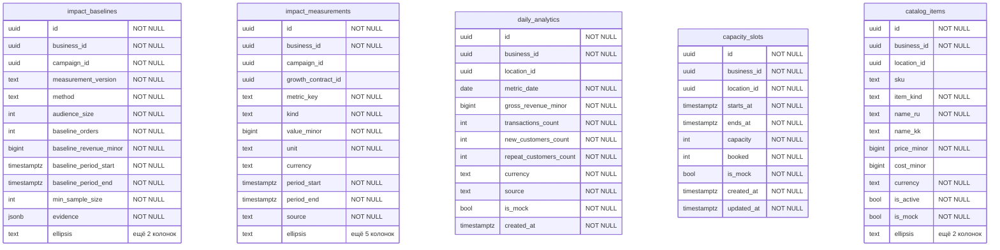

## Витрина «Акции рядом»

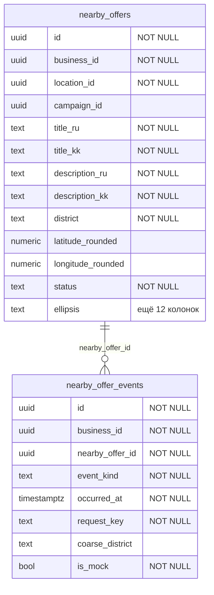

## Каталог платформы

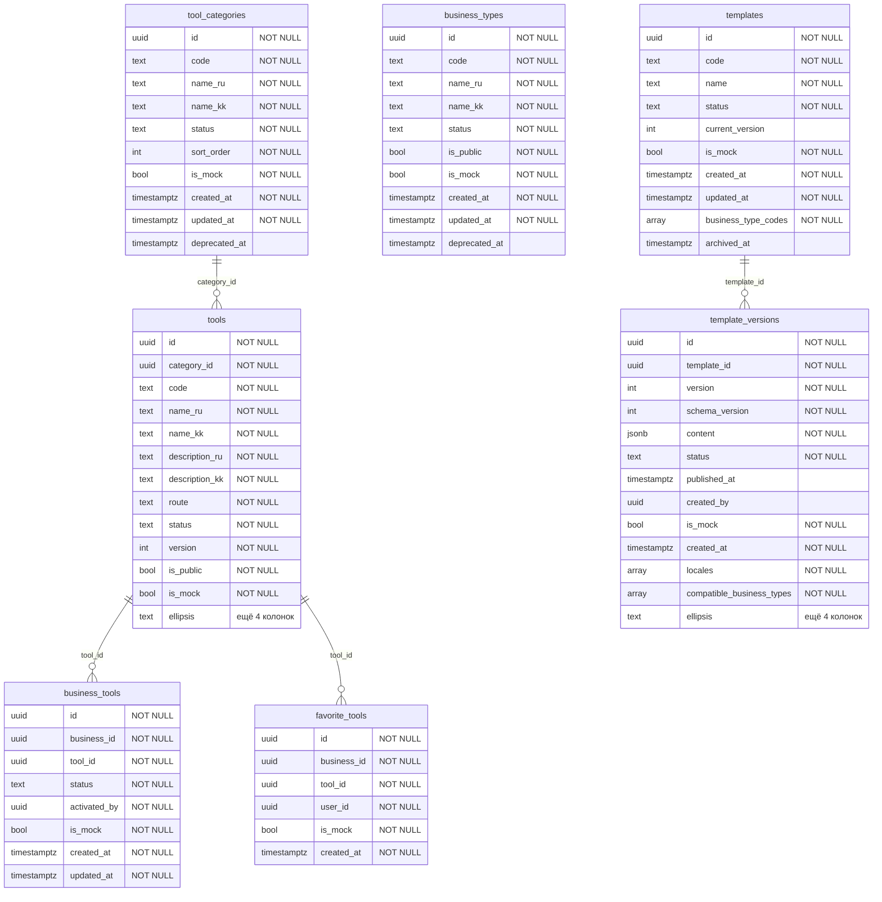

## Тарифы и биллинг

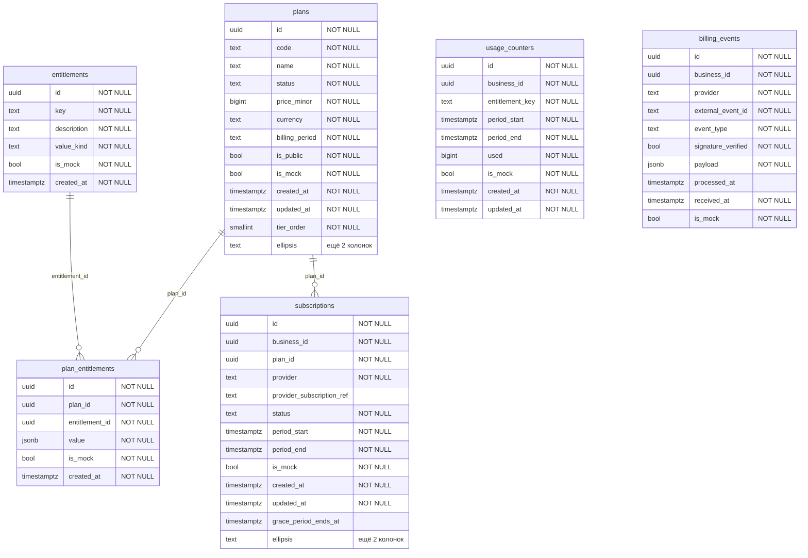

## Управление и приватность

```mermaid
erDiagram
  admin_audit_log {
    uuid id "NOT NULL"
    uuid actor_id "NOT NULL"
    text actor_role "NOT NULL"
    text action "NOT NULL"
    text resource_type "NOT NULL"
    uuid resource_id
    text resource_code
    jsonb before_state
    jsonb after_state
    text reason "NOT NULL"
    timestamptz reauth_verified_at
    timestamptz occurred_at "NOT NULL"
  }
  activity_logs {
    uuid id "NOT NULL"
    uuid business_id "NOT NULL"
    uuid actor_id
    text action "NOT NULL"
    text resource_type "NOT NULL"
    uuid resource_id
    text before_hash
    text after_hash
    jsonb metadata "NOT NULL"
    timestamptz occurred_at "NOT NULL"
    bool is_mock "NOT NULL"
    timestamptz created_at "NOT NULL"
  }
  notifications {
    uuid id "NOT NULL"
    uuid business_id "NOT NULL"
    uuid user_id
    text notification_type "NOT NULL"
    text title "NOT NULL"
    text body "NOT NULL"
    timestamptz read_at
    text action_url
    bool is_mock "NOT NULL"
    timestamptz created_at "NOT NULL"
    text category "NOT NULL"
    timestamptz dismissed_at
  }
  notification_preferences {
    uuid business_id "NOT NULL"
    uuid user_id "NOT NULL"
    text category "NOT NULL"
    bool muted "NOT NULL"
    timestamptz updated_at "NOT NULL"
  }
  privacy_requests {
    uuid id "NOT NULL"
    uuid business_id "NOT NULL"
    uuid customer_id "NOT NULL"
    text request_type "NOT NULL"
    text status "NOT NULL"
    bytea requester_hash "NOT NULL"
    text idempotency_key "NOT NULL"
    jsonb result_summary "NOT NULL"
    timestamptz requested_at "NOT NULL"
    timestamptz completed_at
    bool is_mock "NOT NULL"
    timestamptz created_at "NOT NULL"
    text ellipsis "ещё 3 колонок"
  }
  data_inventory {
    text table_name "NOT NULL"
    text column_name "NOT NULL"
    text classification "NOT NULL"
    bool contains_pii "NOT NULL"
    text storage_form "NOT NULL"
    text lawful_basis "NOT NULL"
    text notes
  }
  retention_policies {
    text record_type "NOT NULL"
    text category "NOT NULL"
    bool contains_pii "NOT NULL"
    int retain_days
    bool anonymize_instead_of_delete "NOT NULL"
    text lawful_basis "NOT NULL"
    text notes
  }
  platform_events {
    uuid id "NOT NULL"
    text event_type "NOT NULL"
    uuid actor_id
    uuid business_id
    jsonb payload "NOT NULL"
    timestamptz occurred_at "NOT NULL"
    bool is_mock "NOT NULL"
    timestamptz created_at "NOT NULL"
  }
  source_connections {
    uuid id "NOT NULL"
    uuid business_id "NOT NULL"
    text provider "NOT NULL"
    text connection_kind "NOT NULL"
    text status "NOT NULL"
    text credential_reference
    text external_account_ref
    timestamptz last_synced_at
    jsonb settings "NOT NULL"
    bool is_mock "NOT NULL"
    timestamptz created_at "NOT NULL"
    timestamptz updated_at "NOT NULL"
  }
```

## Связи между группами

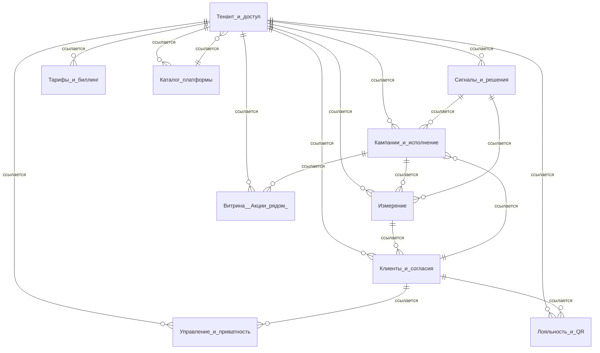
